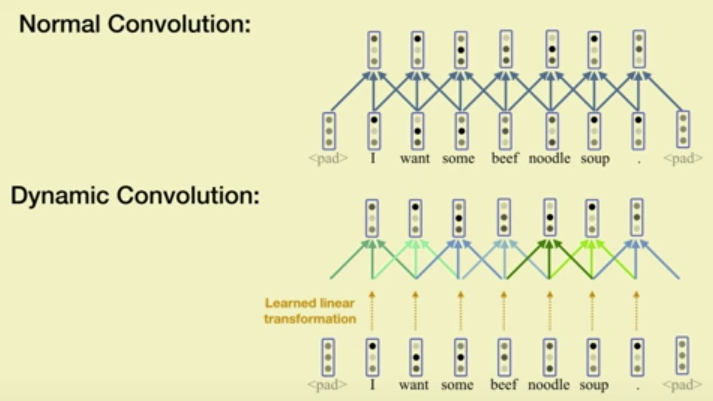
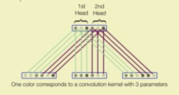
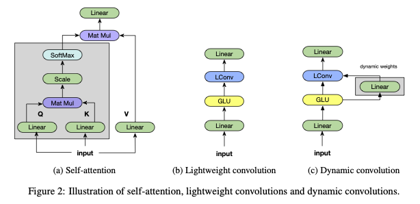

<link rel="stylesheet" href="https://cdn.jsdelivr.net/npm/katex@0.10.2/dist/katex.min.css" integrity="sha384-yFRtMMDnQtDRO8rLpMIKrtPCD5jdktao2TV19YiZYWMDkUR5GQZR/NOVTdquEx1j" crossorigin="anonymous">

### Pay Less Attention with Lightweight and Dynamic Convolutions - Wu et al. 2019
[arXiv](https://arxiv.org/abs/1901.10430)
- Key: replace costly quadratic self-attention with fast, per-timestep 
  convolutions and improve performance

#### 2 Background
let \\(X \in \mathbb{R}^{n \times d}\\)
- Self-attention:
  \\[
  \text{Attention}(Q, K, V) = \text{softmax} ( \frac{QK^T}{\sqrt{d_k}} ) V
  \\]
  where \\(Q = XW_Q, ~ K = XW_K, ~ V = XW_V\\).
  
- Depthwise convolutions:
  
  given that \\(W \in \mathbb{R}^{d \times k}\\) for a kernel width \\(k\\), and an 
  output \\(O \in \mathbb{R}^{n \times d}\\), they define depthwise convolution as
  \\[
  O_{i,c} = \text{DepthwiseConv}(X,W_{c,:},i,c) = \sum_{j=1}^k W_{c,j} X_{(i+j- \lceil \frac{k+1}{2} \rceil), c}
  \\]
  I'm not quite sure why this name, because this equation definitely implies 
  that they're convolving in \\(n\\), the time dimension?

#### 3 Lightweight Convolutions
- Weight sharing:
  
  to reduce the number of parameters in the convolution, tie matrix \\(W\\) into 
  chunks of size \\(\frac{d}{H}\\) in the first dimension of size \\(d\\). This 
  gives us a matrix \\(W \in \mathbb{R}^{H \times k}\\) as the number of trainable
  parameters.
  
  
- Softmax-normalization:
  
  normalize the weights \\(W \in \mathbb{R}^{H \times k}\\) across the temporal 
  dimension (the one of size \\(k\\)) using a softmax
  
- DropConnect:
   
  when dropping weights, drop every entry of normalized \\(\text{softmax}(W)\\) 
  with probability \\(p\\) and divide the total vector by \\(1-p\\) during training
  (removes some temporal info)

So the full expression for Light Convolutions is:
\\[
\text{LightConv}(X,W_{\lceil \frac{cH}{d} \rceil,:}, i, c) = \text{DepthwiseConv}
(X,\text{DropConnect}(\text{softmax}(W_{\lceil \frac{cH}{d} \rceil,:},:)), i, c)
\\]

#### 4 Dynamic Convolutions
now we want to change \\(W\\) based on the input at a timestep

We need a function \\(f : \mathbb{R}^d \to \mathbb{R}^{H \times k}\\), so define a
linear one using \\(W^Q \in \mathbb{R}^{H \times k \times d}\\) such that at some
particular timestep, 
\\[
f(X_i) = W^QX_i = \sum_{c=1}^d W_{h,j,c}^Q X_{i,c}
\\]
and we have the whole expression for dynamic convolutions:
\\[
\text{DynamicConv}(X,i,c) = \text{LightConv}(X, f(X_i)_{h,:}, i, c)
\\]

note that, like self-attention, the weights are changing per timestep

but, unlike self-attention, the changing weights depend only on the current 
timestep, not the whole sequence

##### Full module
Now the full conv block includes other parts, first a linear projection
upscaling the input from \\(d \to 2d\\), \\(W_I \in \mathbb{R}^{d \times 2d}\\)

then a gated linear unit (GLU), with the formula

\\[
\text{GLU}(X) = \sigma(X_{:,(:,d)}) \otimes X_{:,(d,2d)}
\\]

and a linear projection at the output \\(W_O \in \mathbb{R}^{d \times d}\\), so
the block that they actually replace self attention with is in figure 2:

#### 5 Experiments

##### 5.1 Model Architecture
- use the DynamicConv block as a drop-in replacement for any self-attention or 
  encoder-decoder attention in a Transformer (Transformer Big), keep everything 
  else the same
- fewer parameters, so to have a "fair" comparison, increase the number of blocks
  to 7 instead of 6 for the LightConv and DynamicConv versions
- keep the number of decoder blocks at 6
- kernel size: for encoder \\(k \in [3,7,15,31,31,31,31]\\), for decoder \\(k \in [3, 7, 15, 31, 31, 31]\\)
- \\(H=16\\)

##### 5.2 Datasets and Evaluation
- Machine translation (evaluated in BLEU): 
    - WMT En-De (English to German)
    - WMT En-Fr (English to French)
    - WMT Zh-En (English to Chinese)
    - "We train three random initializations of each configuration and report 
      test accuracy of the seed which resulted in the highest validation BLEU.
      Ablations are conducted on the validation set and we report the mean BLEU
      and standard deviation on this set."
    - "For all datasets, we tune a length penalty as well as the number of 
      checkpoints to average on the validation set."
- Language modeling: Billion word dataset (evaluated in perplexity)
- Summarization: CNN-DailyMail summarization, evaluate on F1-Rouge, Rouge-1, 
  Rouge-2, Rouge-L

##### 5.3 Training and Hyperparameters
The gist is that it seems like everything imaginable is tuned
- Translation:
    - dropout
    - different learning rate schedules per dataset
    - different steps 
    - different numbers of GPUs
    - accumulating gradients vs. not
    - different batch sizes
    - label smoothing
    - at least they always use Adam
- Language modeling:
    - remove encoder module
    - adaptive softmax to reduce computational burden (for all models?)
        - tied with variable-sized input word embeddings
        - first 60K have dim 1024
        - next 100K have dim 256
        - last 633K have dim 64
    - Nesterov's accelerated gradient method
    - renormalize gradients if they exceed 0.1 norm
    - cosine learning rate schedule
- Summarization"
    - Adam
    - cosine learning rate schedule
    - weight decay 1e-3
    - dropout 0.3
- also per task they have different kernel sizes \\(k\\) and number of heads \\(H\\)

#### 6 Results
- Machine translation (Table 1 + 2):
    - LightConv does very well: seems like self-attention isn't strictly necessary
    - DynamicConv outperforms
- Ablation of all the bells and whistles (Table 3):
    - they proceed strictly adding features, but one would probably like to see
      a total ablation
    - also timing results - 20% faster than self-attention (but why didn't they
      test the transformer?)
- Language modeling (Table 4):
    - aren't there better standard baselines here? (Google Billion Word)
- Summarization (Table 5):
    - outperforming baselines except for an RL method
    - is this a standard list of baselines?

#### Appendix A
- softmax normalization was required for convergence (and performs a tiny bit
  better than just standard l2 normalization
- I wondered about this choice in transformers as well, is it necessary there?

#### Conclusion
- basically the contribution here is showing that self-attention isn't strictly
  **needed**, but there are so many moving parts it's hard for me to tell what 
  is
- also I went into this paper expecting the size of the kernel (\\(k\\)) and the 
  type of connections to be the dynamic part, but that stays fixed...
